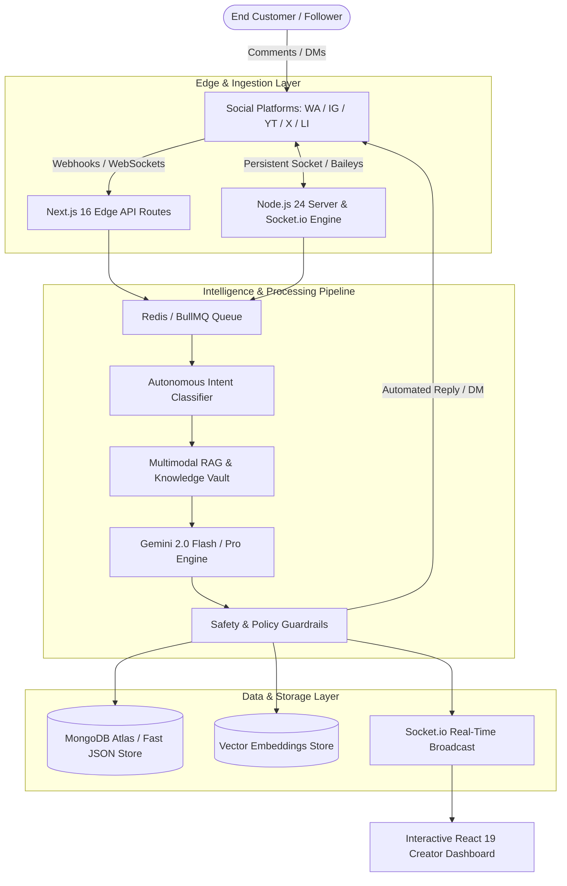

<div align="center">

# ⚡ QuickReply AI
### The Autonomous Omnichannel AI Social Commerce & Conversational Operating System

[](https://quick-reply-ai-seven.vercel.app)
[](https://nextjs.org/)
[](https://react.dev/)
[](https://www.typescriptlang.org/)
[](https://tailwindcss.com/)
[](https://www.mongodb.com/)
[](https://render.com/)
[](https://opensource.org/licenses/MIT)

<p align="center">
  
</p>

[Explore Live Demo](https://quick-reply-ai-seven.vercel.app) • [View Documentation](#-system-architecture) • [API Reference](#-core-api-endpoints) • [Founder Profile](#-solo-founder--creator)

---

</div>

## 🌟 Executive Overview

**QuickReply AI** is an enterprise-grade, autonomous conversational operating system and social commerce engine designed for modern brands, creators, and high-growth businesses. It orchestrates real-time engagement, automated customer support, intent-driven sales pipelines, and multichannel social publishing across **WhatsApp, Instagram, YouTube, LinkedIn, X (Twitter), and Telegram**.

Engineered on **Next.js 16 (App Router)**, **React 19**, **Gemini 2.0 Flash / Pro multimodal models**, and a hybrid **MongoDB Atlas + In-Memory Vector Store**, QuickReply automates the entire lifecycle of a customer interaction—from a public YouTube or Instagram comment to a private WhatsApp direct-message checkout.

---

## 🚀 Key Highlights & Capabilities

```
┌─────────────────────────────────────────────────────────────────────────────┐
│                          QUICKREPLY AI CAPABILITIES                         │
├──────────────────────┬──────────────────────┬───────────────────────────────┤
│ 🤖 Autonomous AGI    │ 💬 Omnichannel WA    │ 🧠 Multimodal RAG             │
│ Intent routing, tone │ WhatsApp Web Baileys │ Catalog search, vector memory │
│ morphing, safety gate│ + Official Cloud API │ instant context retrieval     │
├──────────────────────┼──────────────────────┼───────────────────────────────┤
│ ⚡ Comment-to-DM     │ 📈 Live Analytics    │ 🛡️ Privacy & Security         │
│ Automatic comment-to-│ Real-time ROI graphs,│ AES-256-GCM token encryption, │
│ private sales funnel │ sentiment heatmaps   │ rate-limiting, circuit breaker│
└──────────────────────┴──────────────────────┴───────────────────────────────┘
```

### 1. 🤖 Autonomous AGI Brain & Intent Engine
- **Multimodal Intelligence**: Powered by Google Gemini 2.0 with semantic understanding, emotional tone classification, and dynamic response calibration.
- **Zero-Shot Intent Classification**: Automatically categorizes inbound messages into `Inquiry`, `Pricing`, `Support`, `Lead`, `Complaint`, or `Spam`.
- **Self-Refining Memory Loop**: Persists customer conversational context across touchpoints to provide deeply personalized follow-ups.

### 2. 💬 Multi-Engine WhatsApp Gateway
- **Dual WhatsApp Engine**: Supports both **WhatsApp Web (Baileys QR Session)** for zero-setup onboarding and **WhatsApp Cloud API (Meta Official)** for high-volume enterprise throughput.
- **Live Interactive Simulator**: Built-in phone simulator for real-time rule testing and automated DM validation.
- **Smart Human Handoff**: Seamlessly transfers high-stakes VIP conversations from the AI engine to live support representatives.

### 3. 🎯 Comment-to-DM Social Commerce Funnel
- **Trigger Keyword Interception**: Detects buy-signals like `"Price?"`, `"Link?"`, or `"Discount"` on YouTube and Instagram comments in `< 100ms`.
- **Instant DM Delivery**: Replies publicly with engaging variation and simultaneously delivers product links or coupons directly to the customer's DMs.
- **Deduplication & Anti-Spam Queue**: $O(1)$ LRU deduplication cache prevents repeated responses and adheres strictly to platform rate limits.

### 4. 🧠 Multimodal Catalog RAG (Retrieval-Augmented Generation)
- **Vector-Indexed Knowledge Base**: Ingests product catalogs, PDFs, FAQs, and URLs into cosine-similarity vector embeddings.
- **Dynamic Context Injection**: Generates precise pricing, inventory availability, and specifications in real-time.

### 5. 🛡️ Enterprise Security & Privacy Vault
- **AES-256-GCM Token Rotation**: All OAuth access and refresh tokens are encrypted at rest with zero plain-text leaks.
- **Self-Healing Circuit Breaker**: Gracefully handles API rate limits, network outages, and token invalidations.

---

## 🏗️ System Architecture



---

## 💻 Tech Stack & Engineering Specs

| Layer | Technologies |
| :--- | :--- |
| **Frontend Framework** | Next.js 16.2.7 (Turbopack, App Router), React 19, TypeScript 5.0 |
| **Styling & Motion** | Tailwind CSS v4, Framer Motion, Lucide Icons, Canvas-Confetti, Three.js |
| **Backend & Realtime** | Node.js 24, Socket.io, Express, Webhooks, BullMQ Queue |
| **Database & Cache** | MongoDB Atlas, Mongoose, Redis / Upstash, In-Memory Vector Store |
| **AI & Multimodal LLMs** | Google Gemini 2.0 Flash, Gemini 2.0 Pro, LangChain Core |
| **Social Adapters** | `@whiskeysockets/baileys` (WhatsApp Web), Meta Graph API, YouTube Data API v3, Twitter API v2, LinkedIn API |
| **Security & Auth** | AES-256-GCM Token Encryption, Jose JWT, Google OAuth 2.0 |
| **Hosting & Deployment** | Vercel Global Edge Network (Frontend) + Render Cloud (Backend) |

---

## 📁 Repository Directory Structure

```
QUICK-REPLY/
├── 📁 public/                     # Static assets, logos, and founder headshot
│   ├── founder.png               # High-res portrait of Subhransu Nayak
│   └── favicon.ico               # Brand icon
├── 📁 src/
│   ├── 📁 app/                   # Next.js 16 App Router (156 routes)
│   │   ├── (auth)/               # Authentication: login, register, verify
│   │   ├── (marketing)/          # Landing, about, features, pricing, blog, faq
│   │   ├── 📁 dashboard/         # Real-time Creator Operations Suite
│   │   │   ├── 📁 ai/            # Autonomous Copilot & Briefings
│   │   │   ├── 📁 analytics/     # Live Graphs, Conversion Funnels & ROI
│   │   │   ├── 📁 automations/   # Multi-step Workflow Trigger Chains
│   │   │   ├── 📁 channels/      # 6-Channel Connection Matrix
│   │   │   ├── 📁 faqs/          # Vector Knowledge Base
│   │   │   ├── 📁 feed/          # Unified Omnichannel Inbox
│   │   │   ├── 📁 rules/         # Visual Rule & Trigger Builder
│   │   │   ├── 📁 videos/        # Video Comment Discovery & Polling
│   │   │   └── 📁 whatsapp/      # WhatsApp Web QR + Live Simulator
│   │   └── 📁 api/               # 80+ Serverless REST & Webhook endpoints
│   ├── 📁 backend/               # Core intelligence & autonomous logic
│   │   ├── 📁 brain/             # BusinessBrain & AGI Reasoning Engine
│   │   ├── 📁 intelligence/      # Gemini 2.0 Multimodal Orchestrators
│   │   ├── 📁 privacy/           # AES-256-GCM Token Vault
│   │   ├── 📁 reliability/       # CircuitBreaker & Health Monitor
│   │   ├── cron_manager.ts       # 24/7 Automated Polling Engine
│   │   ├── rag_pipeline.ts       # Vector Search & Document Ingestion
│   │   ├── wa_engine.ts          # WhatsApp Multi-Device Gateway
│   │   └── youtube.ts            # YouTube Data API & OAuth Engine
│   ├── 📁 channels/              # Channel Adapters (WA, IG, YT, X, LI, TG)
│   ├── 📁 database/              # MongoDB Adapter & Hybrid Fallbacks
│   ├── 📁 frontend/              # React 19 UI Components & Zustand Store
│   │   ├── 📁 components/        # Layouts, Sidebars, Mascots, Analytics
│   │   ├── 📁 store.ts           # Central State Management
│   │   └── 📁 hooks/             # Custom WebSockets & Physics Hooks
│   ├── instrumentation.ts        # Next.js Startup Hook & Env Bootstrapper
│   └── middleware.ts             # Auth Session & Edge Route Guard
├── next.config.ts                # Next.js 16 Performance Configuration
├── render.yaml                   # Render Cloud Deployment Blueprint
├── server.js                     # Persistent Node.js & Socket.io Server
├── tailwind.config.ts            # Design System & Token Utilities
└── vercel.json                   # Vercel Serverless & Crons Configuration
```

---

## ⚡ Quick Start & Local Setup

### Prerequisites
- **Node.js**: `v20.x` or `v24.x`
- **npm** or **pnpm**
- **MongoDB** (Local or MongoDB Atlas)
- **Google Cloud OAuth Credentials** (YouTube Data API v3 enabled)

### 1. Clone the Repository
```bash
git clone https://github.com/SubhransuNayak007/NYC-HACKATHON-ROUND-2-.git
cd NYC-HACKATHON-ROUND-2-
```

### 2. Install Dependencies
```bash
npm install
```

### 3. Configure Environment Variables
Create a `.env.local` file in the root directory:

```env
# Application URLs
NEXT_PUBLIC_APP_URL=http://localhost:3000
PORT=3000

# Database Configuration
MONGODB_URI=mongodb+srv://<username>:<password>@cluster.mongodb.net/quickreply?retryWrites=true&w=majority

# Security & Secrets
SESSION_SECRET=your_super_secret_session_key_min_32_characters
JWT_SECRET=your_jwt_signing_secret_min_32_characters
TOKEN_ENCRYPTION_KEY=0123456789abcdef0123456789abcdef0123456789abcdef0123456789abcdef
CRON_SECRET=your_cron_execution_secret

# AI & LLM Providers
GEMINI_API_KEY=your_gemini_api_key

# Google OAuth (YouTube Analytics & Comments)
GOOGLE_CLIENT_ID=your_google_oauth_client_id.apps.googleusercontent.com
GOOGLE_CLIENT_SECRET=your_google_oauth_client_secret

# Meta / WhatsApp Cloud (Optional)
WHATSAPP_PHONE_NUMBER_ID=your_phone_number_id
WHATSAPP_ACCESS_TOKEN=your_meta_system_user_token
```

### 4. Run Development Server
```bash
# Run Next.js frontend & API
npm run dev

# Or run persistent Node.js server with WebSockets
node server.js
```

Open [http://localhost:3000](http://localhost:3000) to access the application.

---

## 📊 Core API Endpoints

<details>
<summary><b>Click to expand API Directory (80+ Endpoints)</b></summary>

### 🔐 Authentication & Session
- `POST /api/auth/login` - Authenticate with email/password
- `POST /api/auth/register` - Create new workspace account
- `GET  /api/auth/google` - Initiate Google OAuth 2.0 consent flow
- `GET  /api/auth/callback/google` - Exchange authorization code for token
- `POST /api/auth/logout` - Clear session tokens

### 💬 Social & WhatsApp Gateway
- `GET  /api/whatsapp/status` - Check WhatsApp connection state & QR
- `POST /api/whatsapp/send` - Send outbound WhatsApp message
- `POST /api/webhooks/whatsapp` - Meta WhatsApp Cloud webhook receiver
- `GET  /api/channels` - List all connected social channels

### 🤖 AI Engine & RAG
- `POST /api/ai/generate-reply` - Generate contextual AI suggestion
- `POST /api/ai/sentiment` - Analyze sentiment & urgency scores
- `POST /api/ai/knowledge/import` - Index new catalog/FAQ document
- `GET  /api/intelligence/briefing` - Fetch daily AI-generated executive digest

### 📈 Rules & Automation
- `GET  /api/rules` - List priority-sorted automation rules
- `POST /api/rules` - Create or update trigger rule
- `POST /api/youtube/poll` - Trigger manual or cron-based comment poll

</details>

---

## 👨‍💻 Solo Founder & Creator

<div align="center">


### **Subhransu Nayak**
**Solo Founder & Lead AI Engineer**  
📍 *Odisha, India*

> *"Learn. Build. Break. Understand. Improve."*

[](https://subhransu-nayak-portfolio.vercel.app/)
[](https://www.linkedin.com/in/subhransu-nayak-4b33383a7/)
[](https://github.com/SubhransuNayak007)
[](mailto:subhransu.nayak.418@gmail.com)

</div>

---

## 📜 License

Distributed under the **MIT License**. See `LICENSE` for more information.

---

<div align="center">
  <b>Built with ❤️ by Subhransu Nayak</b><br>
  <sub>QuickReply AI · Autonomous Omnichannel Conversational OS</sub>
</div>